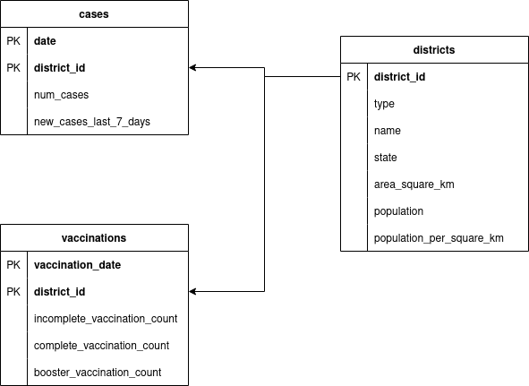

# covid19_cases_vaccinations
COVID-19 cases and vaccination data on district level for Germany

Udacity capstone project

## Summary
The Robert-Koch institute has a daily publication of all new registered
COVID-19 cases in Germany as well as all registered daily vaccinations.
Both datasets are available on a district level.

Combining these two data sources can lead to new insights, for example one
could correlate the ratio of vaccinated people with the number of new COVID
infections for each district and check if higher vaccination rates lead to
fewer infections.

This projects defines a data pipeline that reads the two datasets from public
sources, uploads them to S3 and copies the data from S3 into a Redshift
database. In Redshift, fact and dimension tables are created that provide the
data ready for further analysis.

## Steps taken
todo

## Source data
| Dataset          | Format | No. of rows     | Description                                                                                                        | Source                                                                                                                     |
|------------------|--------|-----------------|--------------------------------------------------------------------------------------------------------------------|----------------------------------------------------------------------------------------------------------------------------|
| Case data        | JSON   | ca. 4.5 million | Daily updated dataset containing all information (e.g. demographics) of every registered COVID-19 case for Germany | [RKI](https://github.com/ard-data/2020-rki-archive)                                                                        |
| Vaccination data | CSV    | ca. 930,000     | Daily updated dataset cotaining the number of administered COVID-19 vaccinations                                   | [RKI](https://github.com/robert-koch-institut/COVID-19-Impfungen_in_Deutschland/)                                          |
| District data    | XLSX   | 494             | Information for each district of Germany, e.g. the population and the state it belongs to.                         | [Destatis](https://www.destatis.de/DE/Themen/Laender-Regionen/Regionales/Gemeindeverzeichnis/Administrativ/04-kreise.html) |

## Data model

## Data dictionary of the data model

### Cases table
| Column name           | Type | Description                                                                   |
|-----------------------|------|-------------------------------------------------------------------------------|
| date                  | date | Date when the case was reported                                               |
| district_id           | int  | ID of the district                                                            |
| num_cases             | int  | Number of cases for a specific date and district                              |
| new_cases_last_7_days | int  | Rolling sum of the number of cases over the last seven days for each district |

### Vaccinations table
| Column name                  | Type | Description                                                                                                                            |
|------------------------------|------|----------------------------------------------------------------------------------------------------------------------------------------|
| vaccination_date             | date | Date of the vaccination                                                                                                                |
| district_id                  | int  | ID of the district                                                                                                                     |
| incomplete_vaccination_count | int  | Number of vaccinations that do not give full protection yet                                                                            |
| complete_vaccination_count   | int  | Number of vaccinations that give full protection (i.e. one shot with the Johnson&Johnson vaccine, or two shots with any other vaccine. |
| booster_vaccination_count    | int  | Number of booster shots on top of a completed series of vaccinations                                                                   |

### District table
| Column name              | Type  | Description                                |
|--------------------------|-------|--------------------------------------------|
| district_id              | int   | ID of the district                         |
| type                     | text  | District type (e.g. city or "Landkreis")   |
| name                     | text  | District name                              |
| state                    | text  | Name of state that the district belongs to |
| area_quare_km            | float | Area of district in square kilometers      |
| population               | int   | Total population of the district           |
| population_per_square_km | int   | Population per square kilometer            |

## Example queries

## Running the pipeline
### Prerequisites
In order to run the data pipeline, you need to have the following:
- An AWS account with a running Redshift cluster that is publicly accessible
- An IAM user with read and write permissions for S3 as well as full access to
the Redshift cluster
- A running Airflow v2 instance (see `requirements.txt`).
[Airflow can be run locally.](https://airflow.apache.org/docs/apache-airflow/stable/start/local.html)

### Configuration
- Check the two DAG files in the `dags/` subfolder. Each of them has a `conf`
object that holds thea required configuration. You should change the name of
the S3 bucket.
- In Airflow, create two new connections:
  - An Amazon Web Services connection named `aws_credentials` with the access
  key and secret key of the IAM user.
  - A Postgres connection named `redshift` with the credentials to access the
  Redshift cluster.
- Check that the start date and the `catchup` setting of the `get_source_data`
DAG is appropriate. The datasets published on each day contain all the data
up until that day, so you only need to download the most recent file per
dataset in order to have all the data.

### Running it
There are two DAGs, `init_database` and `get_source_data`. The first one is a
one-time job that creates the neccessary tables in Redshift and copies static
data that does not change over time.

The second DAG can is scheduled daily by default so that it fetches the
updated datasets every day.

So, you need to run `init_database` once before you can start running
`get_source_data`.

**Note**: the case dataset is quite large (around 2GB), so the upload to S3
will take some time (depending on your internet connection).

## Other scenarios
#### The data was increased by 100x.
Since Redshift is a distributed databse, it is well suited for big data tasks.
Redshift could be scaled out by increasing the number of nodes, as well as
scaled up by increasing the computing power of a single node.

The bottleneck of the data pipeline is the upload of the large case dataset
to S3. If that dataset was increased x100, the pipeline would need to run on a
machine with a high-speed network connection, e.g. a large EC2 instance on AWS.

#### The pipelines would be run on a daily basis by 7 am every day.
This is already taken into account. The main pipeline `get_source_data` is
supposed to be scheduled daily. In order to run them at 7 a.m. you just need
to adjust the `schedule_interval` setting to a cron expression.

#### The database needed to be accessed by 100+ people.
This is again no problem with Redshift. In case there are not enough resources
to run queries by all the people, the cluster can be scaled easily.

## Improvements
- unit tests
- atomic tasks
- include age group